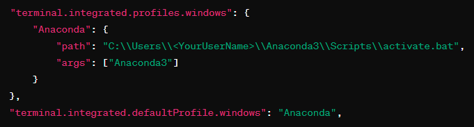

# Configuración del proyecto

## 1. Configuración de ambiente Anaconda (Windows)

Descargar e instalar el ejecutable del sitio oficial: https://www.anaconda.com/download

Reiniciar el computador para verificar la instalación.

## 2. ***(OPCIONAL)*** Configurar Anaconda Prompt en Visual Studio Code

1. Ir a Configuraciones (File > Preferences > Settings).
2. Buscar "*terminal.integrated.profiles.windows*" (o "*terminal.integrated.profiles.linux/macOS*" dependiendo del sistema operativo).
3. Editar la configuración para incluir el path hacia Anaconda Prompt

`    "Anaconda": {
        "path": "C:\\Users\\<YourUserName>\\anaconda3\\Scripts\\activate.bat",
        "args": ["Anaconda3"]
    }
`

***NOTA: la línea `"terminal.integrated.defaultProfile.windows": "Anaconda"` es opcional***

# Comandos Anaconda

|Acción|Descripción|Comando|
|-:|:-:|:-|
|**Create Environment**|Crea un entorno virtual|`conda create --name <my-env>`|
|**List Environment**|Lista los entorno virtuales existentes|`conda info --envs`|
|**Use Environment**|Selecciona y activa un entorno virtual|`conda activate <my-env>`|
|**Remove Environment**|Elimina un entorno virtual|`conda remove --name <my-env> --all`|
|**Library List**|Lista las librerías en un entorno|`conda list`|