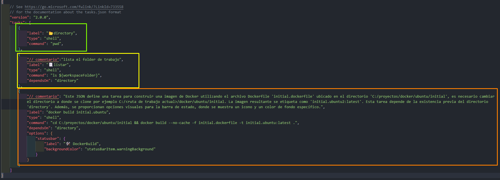
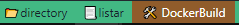

# Construcción de imágenes Docker

## Build imagenes docker

### Imagen "Initial"

Estando en la carpeta "**initial**", lanzar el siguiente comando:

***NOTA: Si se esta usando docker como plataforma de contededores ejecutar***
  `docker build --no-cache -f initial.dockerfile -t initial.ubuntu:latest .`

***NOTA: Si se esta usando podman como plataforma de contededores ejecutar***
`podman build --no-cache -f initial.dockerfile -t initial.ubuntu:latest .`

## DockerBuild con tasks

Estando en Visual Studio Code, instalamos la extensión Tasks (actboy168.tasks), esto nos permite interactual con la barra de información, adicionalmente automatizar los pasos de compilació, ya con el archivo tasks.json, delimitamos las tareas y que se ejecute.

Compilación usando la extension Tasks y archivo task.json

Para usar el DockerBuild se debe ajustar el objeto json, con la ruta donde se clona el repositorio, para el ejemplo se uso la ruta "C:/proyectos/docker/ubuntu/initial" ; docker build --no-cache -f initial.dockerfile -t initial.ubuntu:latest .".

NOTA: Si se va a usar la extension Tasks en Visual Studio Code es necesario actualizar la ruta donde se clono el proyecto, ejemplo:
`C:/<ruta de trabajo actual>/docker/ubuntu/initial`

## Ejecución de imágenes Docker

Para ejecutar una imagen

`docker run --rm "nombre de la imagen"`

### Ejemplo

`docker run --rm initial.ubuntu:latest`

## Ejecución de un Contenedor Docker

Para ejecutar un contenedor Docker:

`docker run -it -d <<ID_CONTENEDOR>> bash`

### Ejemplo

`docker run -it -d 75acbac80a32 bash`

## Ejecuta un shell interactivo Bash  o Shell dentro de un contenedor Docker específico

`docker exec -it <<ID_CONTENEDOR>> bash` o  `docker exec -it <<ID_CONTENEDOR>> sh
`
Ejemplo:

`docker exec -it 9850fad356a2e308e02a5b644883bb89b26c48f1db37270def1022735ccf14f9 bash` o `docker exec -it 9850fad356a2e308e02a5b644883bb89b26c48f1db37270def1022735ccf14f9 sh`

***NOTA: Es importante reemplazar las comillas (""), los corchetes angulares (<<>>) y proporcionar los datos requeridos.***
